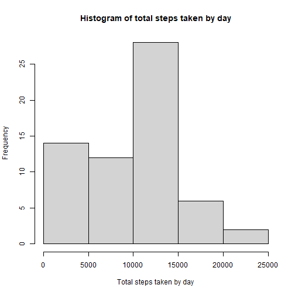
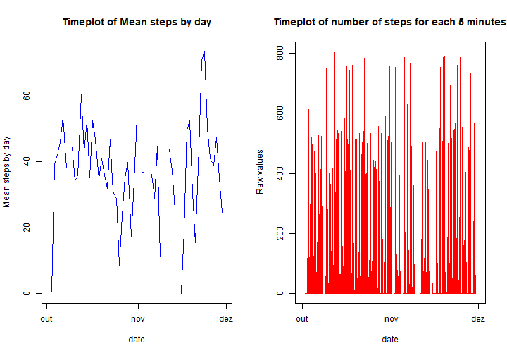
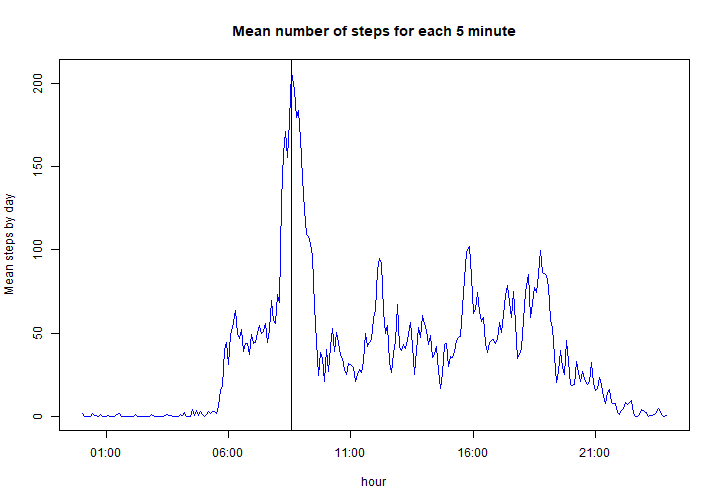
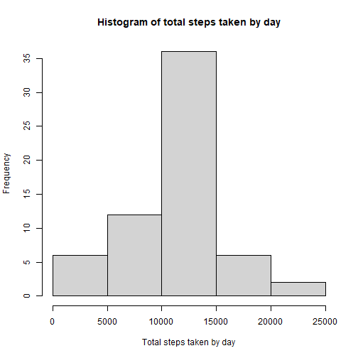

# Activity monitoring analysis
================================
## Loading and processing the data


```r
library(stringr)
library(dplyr)
library(data.table)
library(lattice)
library(ggplot2)
data<-read.csv('activity.csv')

#Creating datetime column from date and interval values
data$interval<-with(data,str_pad(interval,4,pad='0'))
data$datetime<-with(data,paste0(date,';',substr(interval,1,2),';',substr(interval,3,4)))
data$datetime<-with(data,as.POSIXct(datetime,format='%Y-%m-%d;%H;%M'))

#Creating auxiliary columns
data$day<-format(data$datetime,'%d')
data$month<-format(data$datetime,'%m')
data$minute<-format(data$datetime,'%M')
data$hour<-format(data$datetime,'%H')
data$day_of_week<-wday(data$datetime)
data$weekday<-ifelse((data$day_of_week==1)|(data$day_of_week==7),'weekend','weekday')

head(data)
```

```
##   steps       date interval            datetime day month minute hour day_of_week weekday
## 1    NA 2012-10-01     0000 2012-10-01 00:00:00  01    10     00   00           2 weekday
## 2    NA 2012-10-01     0005 2012-10-01 00:05:00  01    10     05   00           2 weekday
## 3    NA 2012-10-01     0010 2012-10-01 00:10:00  01    10     10   00           2 weekday
## 4    NA 2012-10-01     0015 2012-10-01 00:15:00  01    10     15   00           2 weekday
## 5    NA 2012-10-01     0020 2012-10-01 00:20:00  01    10     20   00           2 weekday
## 6    NA 2012-10-01     0025 2012-10-01 00:25:00  01    10     25   00           2 weekday
```

## Exploring the data

### What is mean total number of steps taken per day?


```r
data_total_by_day<-data %>% group_by(month,day) %>% summarise(total_steps=sum(steps,na.rm = TRUE),.groups = 'drop')
hist(data_total_by_day$total_steps,xlab='Total steps taken by day',main='Histogram of total steps taken by day')
```



Most days have a total of 10k to 15k steps


```r
data_mean<-mean(data_total_by_day$total_steps,na.rm=TRUE)
data_median<-median(data_total_by_day$total_steps,na.rm=TRUE)
print(paste0('The mean value of steps per day is: ',as.character(round(data_mean,digits=2))))
```

```
## [1] "The mean value of steps per day is: 9203.35"
```

```r
print(paste0('The median value of steps per day is: ', as.character(round(data_median,digits=2))))
```

```
## [1] "The median value of steps per day is: 10349.5"
```

From the second graph it is possible to see that there is a high variation in the data, with a lot of 5 minute intervals having no steps and some intervals having more than 600 steps.

The period with most steps was the second half of november.

### What is the average daily activity pattern??


```r
data_mean_by_day<-data %>% group_by(month,day) %>% summarise(mean_steps=mean(steps,na.rm = TRUE),.groups = 'drop')
data_mean_by_day$date<-with(data_mean_by_day,ISOdate(2012,month,day))

par(mfrow=c(1,2))
plot(data_mean_by_day$date,data_mean_by_day$mean_steps,type='l',xlab='date',ylab='Mean steps by day',main='Timeplot of Mean steps by day',col='blue')
plot(data$datetime,data$steps,type='l',xlab='date',ylab='Raw values',col='red',main='Timeplot of number of steps for each 5 minutes')
```




```r
data_mean_by_5min<-data %>% group_by(hour,minute) %>% summarise(mean_steps=mean(steps,na.rm = TRUE),.groups = 'drop')
data_mean_by_5min$date<-with(data_mean_by_5min,ISOdatetime(year=1970,month=12,day=01,hour=hour,min=minute,sec=0))

max_avg_steps<-subset(data_mean_by_5min,mean_steps==max(data_mean_by_5min$mean_steps))
print(paste0('The maximum mean number of steps for a 5 minute interval occurs at ',format(max_avg_steps$date,'%H:%M'),' and is equal to ',as.character(round(max_avg_steps$mean_steps,digits=2))))
```

```
## [1] "The maximum mean number of steps for a 5 minute interval occurs at 08:35 and is equal to 206.17"
```

```r
plot(data_mean_by_5min$date,data_mean_by_5min$mean_steps,type='l',xlab='hour',ylab='Mean steps by day',main='Mean number of steps for each 5 minute',col='blue')
abline(v=max_avg_steps$date)
```



### Imputing missing values


```r
total_na<-sum(is.na(data$steps))

print(paste0('Total missing values: ',total_na))
```

```
## [1] "Total missing values: 2304"
```

```r
print(paste0('Percentage of missing values: ',round(total_na/dim(data)[1]*100,2),'%'))
```

```
## [1] "Percentage of missing values: 13.11%"
```


```r
#Substituting na values by the mean value of the 5min interval
substitute_function<-function(x){
                if (is.na(x['steps'])){
                                as.numeric(unlist(subset(data_mean_by_5min,minute==x['minute']&hour==x['hour'])['mean_steps']))

                }
                
                else{x['steps']}
}

data$steps_substituted<-as.numeric(unlist(apply(data,1,substitute_function)))
```


```r
data_total_by_day<-data %>% group_by(month,day) %>% summarise(total_steps=sum(steps_substituted,na.rm = TRUE),.groups = 'drop')
hist(data_total_by_day$total_steps,xlab='Total steps taken by day',main='Histogram of total steps taken by day')
```



By substituting the NA values, the data tended to be most distributed near the mean of 10k steps.


```r
data_mean<-mean(data_total_by_day$total_steps,na.rm=TRUE)
data_median<-median(data_total_by_day$total_steps,na.rm=TRUE)
print(paste0('The mean value of steps per day is: ',as.character(round(data_mean,digits=2))))
```

```
## [1] "The mean value of steps per day is: 10592.56"
```

```r
print(paste0('The median value of steps per day is: ', as.character(round(data_median,digits=2))))
```

```
## [1] "The median value of steps per day is: 10766.34"
```

The mean and median had their valued increased, also being close to each other and to the median of the values.

### Are there differences in activity patterns between weekdays and weekends?


```r
data_mean_by_5min_weekday<-data %>% group_by(hour,minute,weekday) %>% summarise(mean_steps=mean(steps,na.rm = TRUE),.groups = 'drop')
data_mean_by_5min_weekday$date<-with(data_mean_by_5min_weekday,ISOdate(year=2012,month=11,day=01,hour=hour,min=minute,sec=0))


xyplot(mean_steps~date|weekday,data=data_mean_by_5min_weekday,layout=c(1,2),type='l',date.format = '%H:%M')
```


From the graph it is possible to see the person walked in a more distributed way during the weekend. During the day, the person normally walked more in the morning.
